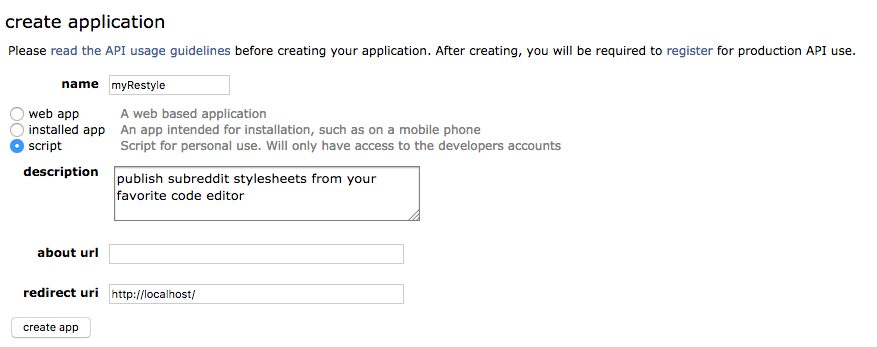
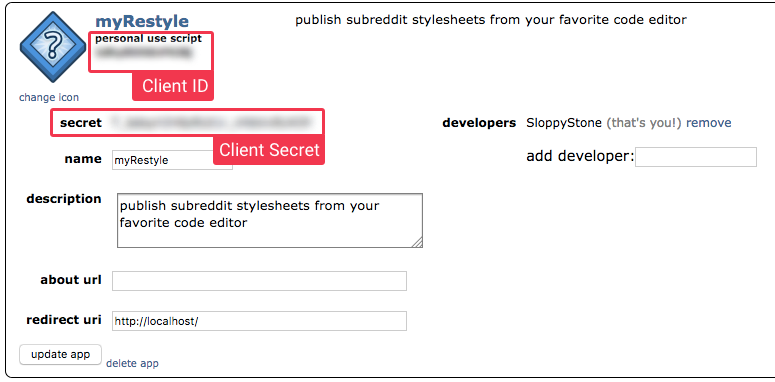

<div align=center>

</img>

<p style="font-size:12px">Publish subreddit stylesheets from your favorite code editor</p>

#

</div>

Restyle for reddit is a tool for writing reddit stylesheets with your favorite code editor. It let's you write SCSS and publish it as compressed CSS straight to specified subreddit you moderate. All you need is a reddit app credentials (client id and secret), restyle config file and you're good to go!

## Setting up

## Requirements

* Node 9.x.x and NPM (or yarn) [Install node](https://nodejs.org/en/)

#

## Installing

Create a new folder and run

```
$ yarn init -y
$ yarn add restyle-reddit  
```

## Create reddit application

In order to publish CSS with restyle, you need to have an authenticated script-like reddit app. Login to your reddit account and browse to [prefs/apps/](https://www.reddit.com/prefs/apps/)  
Click the `create another app...` button and fill out the required fields. **Remember to choose `script` as your application type.**



Hit `create app` once done.

## Restyle config

Open the newly created restyle folder and create a file called `restyle.config.js` to the root of the project folder.

Copy & paste this into the new file and fill out the properties:

```javascript
const path = require('path')

// Fill out the fields
module.exports = {
  credentials: {
    username: // Your reddit username,
    password: // Your reddit password,
    clientId: // App client ID,
    clientSecret: // App client Secret
  },

  /* `input` is the project path you want to edit
     your stylesheet. `output` is the target path
     in which restyle compiles the SCSS you write
     to CSS and uses that path to publish
     the stylesheet to your target subreddit      */
  input: path.resolve(__dirname, 'src/style.scss'),
  output: path.resolve(__dirname, 'dist/index.css'),

  subreddit: // Subreddit you want to target (you need to be the moderator)
}
```

Remember the app you just created on reddit? Copy these values from the app page, and use them in your `restyle.config.js` file.



## Writing SCSS

Now the fun begins! Create the input/output folders you specified in `restyle.config.js`. Create the \*.scss file in the `input` folder.

Now write whatever SCSS you want.

## Watch for file changes and publish to subreddit

Restyle can watch for file changes and compile/publish the results to your subreddit automatically. Run `$ node_modules/.bin/restyle publish` once you're ready and watch the magic happen on your specified subreddit.

## Want to help make Restyle better?

you can find the [Github repository here!](https://github.com/yliaho/restyle-for-reddit)
