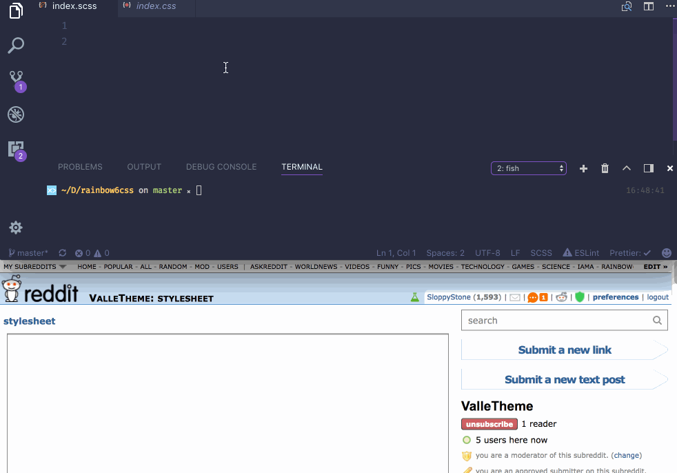

</img>

Publish subreddit stylesheets from your favorite code editor

#

</img>

## Setting up

### Requirements

* You need Ruby and Sass (command line) to compile .scss files to .css. [How to install Sass to your computer](http://sass-lang.com/install)
* Node 9.x.x and NPM (or yarn) [Install node](https://nodejs.org/en/)

#

* Clone this repository `git clone https://github.com/yliaho/restyle-for-reddit.git`
* cd to the folder and run `npm init` or `yarn`
* Create new reddit app (script) credentials with your reddit user. [Link](https://www.reddit.com/prefs/apps/)
  * Copy the Client ID (the code right below the app name and 'personal use script') and client secret and add them to `.env.example`. Rename `.env.example` to `.env`
* Open up `restyle-config.js` and make sure to fill out the `subreddit` property with your own subreddit.
* If you want to edit your stylesheets with SCSS. make a file called `index.scss` to `src` folder and edit away.
* Run `npm run watch` when you're ready to compile to css.
* Run `npm run publish` when you want to publish the css from `dist` to specified subreddit
